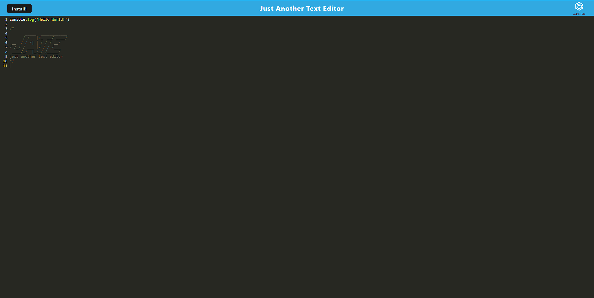

# JATE (Just Another Text Editor)

## Deployed Application

https://jate-text-jate-editior-jate.herokuapp.com/

## Description

JATE is a PWA Text Editor application you can use in your broswer and download to use when you're offline. JATE uses service workers and IndexDB to offer structured client-side storage even when you're not connected to the internet. Using webpack configurations, JATE only bundles and renders what assets it's users need in order to run more effeciently.

## Built With

- HTML5
- CSS3
- JavaScript
- NodeJS
- Express.JS
- Webpack
- IndexDB
- Service Workers
- various NPM packages

## Screenshot

